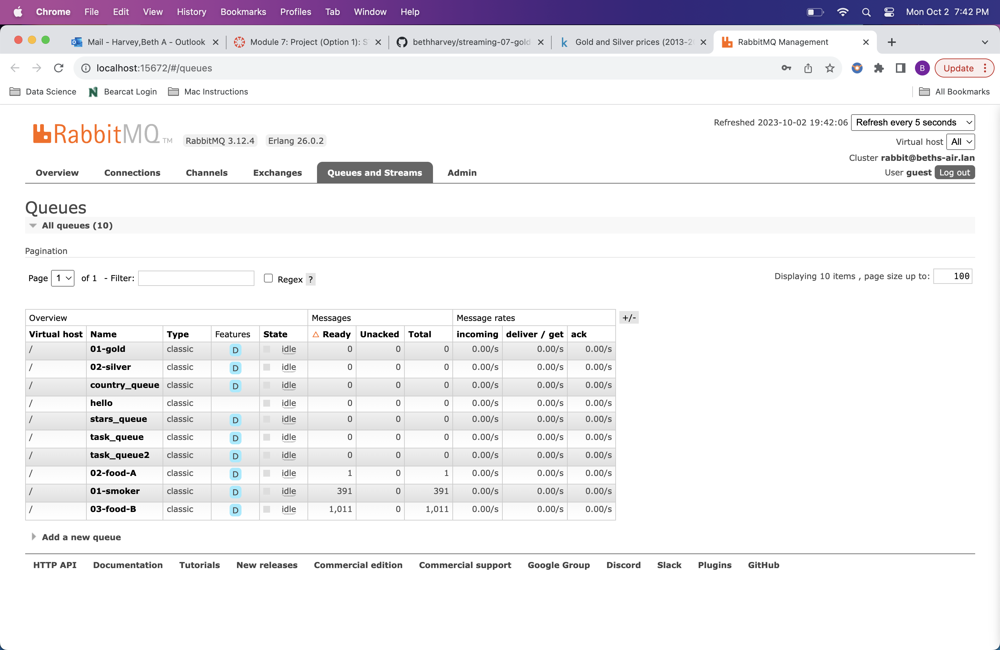
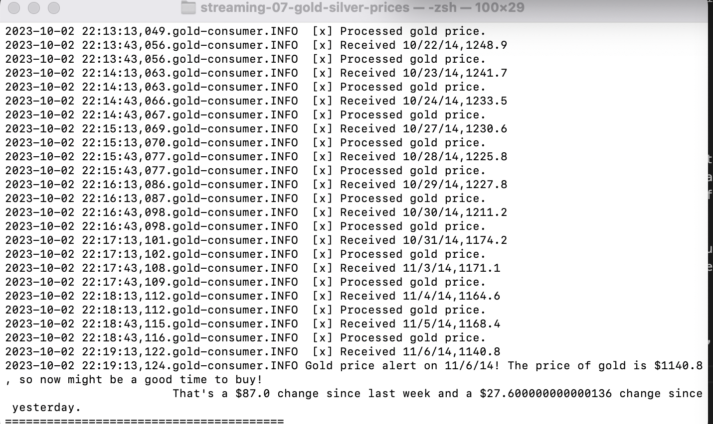
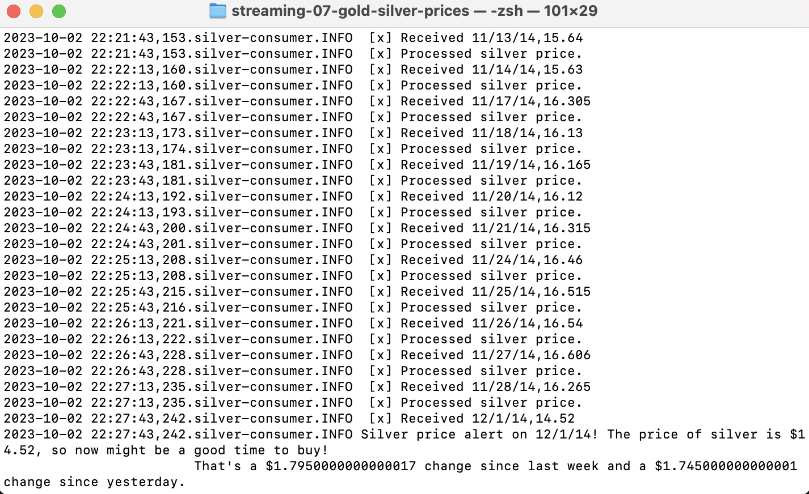
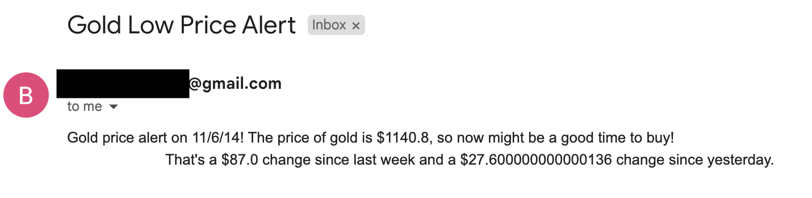
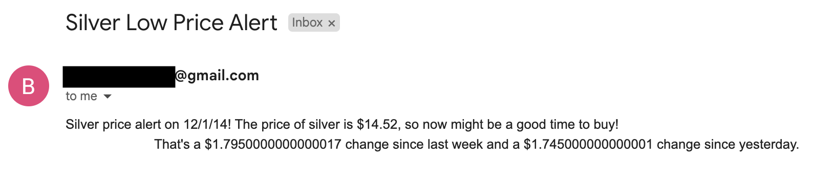

# Gold and Silver Price Streaming and Alerts

* Beth Harvey
* Streaming Data
* Module 7
* September 30, 2023

## Project Overview

The goal of this project is to use RabbitMQ to create one producer and two consumers to stream rows of data containing daily gold and silver prices from August 19, 2013 to August 17, 2023. One consumer is for gold prices and one for silver prices. Alerts are sent when gold prices are above \$1850 (suggest selling) or below \$1150 (suggest buying) and when silver prices are above \$27 (suggest selling) or below \$15 (suggest buying). These thresholds could be adjusted to the user's preferences and help them know when gold or silver have reached their chosen buying/selling prices without having to check the prices every day. The opening price for the day is used for this project, but the closing price, high price, or low price can also be used.

## Data

The original data for this project is from Kaggle and can be found at https://www.kaggle.com/datasets/kapturovalexander/gold-and-silver-prices-2013-2023?select=gold+prices.csv. I sorted the entries by oldest to newest date and combined the gold and silver data to create one dataset.

## Requirements

1. Git
2. Python 3.11+ 
3. VS Code Editor
4. VS Code Extension: Python (by Microsoft)
5. RabbitMQ Server installed and running locally
6. Virtual Environment
    * `python3 -m venv .venv`
    * `source .venv/bin/activate`
7. Pika
    * `python3 -m pip install pika`

## Files

* .evn-example.toml: An example file for configuring email login information for email alerts
* email_alerts.py: Creates and sends email alerts upon price alert events for the two queues
* gold-consumer.py: Receives messages from the 01-gold queue and processes them to monitor for alert events
* gold-silver-prices.csv: Data file containing gold and silver prices used for the producer and consumers
* price-producer.py: Streams rows from the gold-silver-prices data file, creates messages, and sends them to the appropriate queue
    * The producer sends messages to an exchange, which then routes it to the designated queue.
    * Two queues are used for this project: 01-gold and 02-silver. They are both persistent queues, so they will survive a broker restart.
* silver-consumer.py: Receives messages from the 02-silver queue and processes them to monitor for alert events
* util_logger.py: Logs and records script events into the logs folder

## Process

* 

## Running the Code

In a terminal window, navigate to the folder containing this repo, create and activate a virtual environment (see requirements above), and install Pika (see requirements above). Run the producer file by entering:

    python3 price-producer.py

Enter "y" to open the RabbitMQ queue monitor (enter "guest" as the username and password) or "n" to skip that step. The script will stream messages from one row of data every 30 seconds, and a confirmation message will be displayed in the terminal for each message. The stream will end when the entire file has been streamed or upon user interruption using CTRL+C.

The queue is deleted and redeclared when the script is started.

The process for running the consumers is very similar to the producer. Navigate to the proper directory, activate the virtual environment, and enter:

    python3 [name of consumer file]

Note that the producer should be started before the consumers, since the producer deletes the queues on startup.

## Email Alerts

To send email alerts for the various price event alerts, use .env-example.toml as a template to enter the desired email address and password. Add this file to your .gitignore to make sure it is not shared. Note: For a Gmail address, an app password should be used in place of the account password. Instructions for setting up an app password can be found here: https://support.google.com/accounts/answer/185833?hl=en

To deactivate email alerts, remove or comment out the "createAndSendEmailAlert()" function call in each of the consumer callback functions in gold-consumer.py and silver-consumer.py.

## Screenshots

See examples of the RabbitMQ queue monitor page, the running scripts, and the terminal and email alerts.

#### RabbitMQ Monitor Page
This page can be used to monitor any RabbitMQ queues you have created or used.

#### Price Producer and Consumers Running

#### Gold Alert

#### Silver Alert

#### Gold Email Alert Example

#### Silver Email Alert Example
